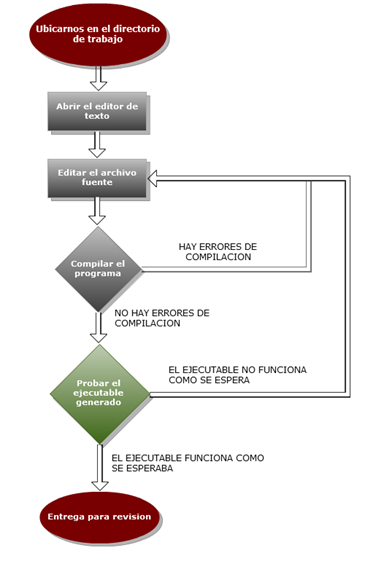
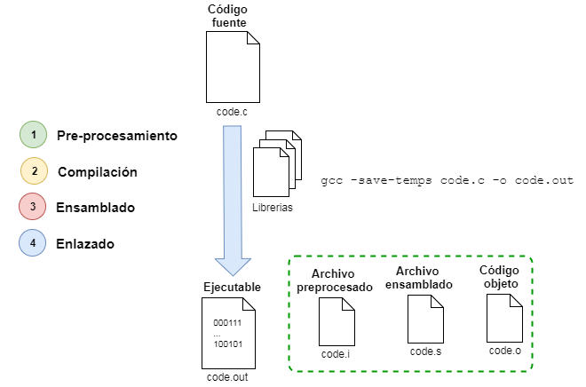

# Introduccion al lenguaje C

## Objetivos ##

> 1. Comprender y usar el lenguaje de progrmación C.
> 2. Aprender a emplear de manera basica el GCC (GNU compile colection) para codificar y compilar programas en C.
> 3. Codificar aplicaciones en C haciendo esta herramienta.

## Antes de empezar ##

Antes de empezar el laboratorio, acepte el link en el cual se muestra la tarea. Luego de esto, elija un directorio de trabajo apropidado y clone alli la tarea. Suponiendo que el directorio de trabajo se llamase: ```/home/don_ramon/Documents/sistemas_operativos/lab_C``` y el repositorio correspondiente estuviera en https://github.com/so-udea/intro-C, los comandos a aplicar seran similares a los mostrados a continuación:

```bash
cd /home/don_ramon/Documents/sistemas_operativos/lab_C
git clone https://github.com/so-udea/intro-C.git
cd intro-C
ls
```

Para profundizar mas sobre la información que se tratara a continuación, puede consultar los siguientes links:
1. [GCC and Make - Compiling, Linking and Building C/C++ Applications](https://www.ntu.edu.sg/home/ehchua/programming/cpp/gcc_make.html)
2. [Manejo básico del GNU Compiler Collection (GCC)](https://github.com/repos-SO-UdeA/laboratorios/tree/master/lab0/teoria/parte2/teoria)
3. [GCC and Make - Compiling, Linking and Building C/C++ Applications](https://www3.ntu.edu.sg/home/ehchua/programming/cpp/gcc_make.html)
4. [Una Introducción a GCC](http://www.nongnu.org/gccintro-es/gccintro.es.pdf)

## Introducción al GCC ##

### Elementos necesarios ###
Existen muchas herramientas de compilación; sin embargo, a lo largo del laboratorio se va a hacer uso de GCC, el cual es el compilador por excelencia para Linux. Para compilar un programa se necesitan 3 elementos principalmente. En nuestro caso:
1. PC con un sistema operativo: luede ser cualquier sistema operativo, pero para desarrollo, el sistema operativo por excelencia siempre va a ser Linux.
2. Un compilador: las versiones de Linux suelen venir con el compilador gcc; en el caso de Windows, es necesario descargarlo, existen dos que pueden ser útiles: el Cygwin y el MinGW.
3. Un Editor de textos o entorno de desarrollo (IDE): existen muchos tanto en modo texto (vi, emacs, vim, etc) como en modo grafico (codeblocks, qtcreator, eclipse, devc++, visual studio code, etc.).

### Proceso de compilación de aplicaciones ###

La siguiente figura muestra el proceso que se sigue generalmente para codificar y compilar una aplicación un programa.


**Figura 1**. Proceso de compilación.


#### Actividad 1 ####

Tome como base el tutorial [How to Compile and Run a C Program on Ubuntu Linux](http://webhotel4.ruc.dk/~keld/teaching/CAN_e14/Readings/How%20to%20Compile%20and%20Run%20a%20C%20Program%20on%20Ubuntu%20Linux.pdf). A continuación se muestra el código C que alli se muestra:

```C
#include <stdio.h>

main() {
 printf("Hello World\n");
 return 0;
}
```

Codifique el programa, guardelo como **hello.c**. Ahora realizar el primer commit y suba a github el archivo fuente, luego, compilelo y ejecutelo empleando los siguientes comandos:

```bash
gcc -o hello hello.c
./hello
```

Observe que los resultados sean parecidos a los del pdf. Luego tome una captura, guarderla y realice el respectivo commit asociado a esta (que sea bien descriptivo). Finalmente borre el archivo ejecutable **hello**:

```bash
rm hello
```

### Comprendiendo los comandos anteriormente vistos ###

Como lo pudo notar en el caso anterior, se generó un ejecutable a partir de un archivo fuente. Vamos a tratar con un poco mas de detalle esta y otra forma de llevar a cado este proceso:

1. **Generando el ejecutable en un solo paso**

```bash
gcc archivoFuente –o nombreEjecutable -Wall
```

**Dónde**:
* **archivoFuente**: Archivo de extensión **.c** que será compilado y enlazado.
* **nombreEjecutable**: Nombre del ejecutable generado tras la ejecución del comando.
* **-Wall**: Esta opción activa todos las advertencias más comunes ¡se recomienda usar siempre esta opción!. Por defecto GCC no produce advertencias a menos que estén activadas. Las advertencias del compilador son una ayuda esencial detectando problemas al programar en lenguaje C.

La anterior forma de uso del comando gcc, suele ser la más sencilla para compilar y enlazar un archivo fuente (archivo **.c**) de modo que se genera un ejecutable con nombre dado  por **nombreEjecutable**. 

**Ejemplo**: Recordando el ejemplo anterior, si queremos generar a partir de hello.c un ejecutable llamado hello.out tenemos:

```bash
gcc hello.c -o hello.out
```

2. **Generando el ejecutable mediante compilacion por pasos (se eliminan los archivos intermetios)**

El proceso de obtener un archivo ejecutable (entendible por la máquina) a partir de un archivo fuente (escrito en lenguaje de programación y entendido por el programador) involucra 4 etapas, las cuales son principalmente:
1. Pre-procesamiento.
2. Compilación.
3. Ensamblado.
4. Enlazado.

La siguiente figura tomada de [GCC and Make - Compiling, Linking and Building
C/C++ Applications](https://www.ntu.edu.sg/home/ehchua/programming/cpp/gcc_make.html) resume los pasos anteriormente explicados:


**Figura 15**. Resumen del proceso completo de compilación y enlazado.

La siguiente tabla resume los comandos aplicados anteriormente:

| Paso | Acción            | Comando                                     | 
|------|-------------------|---------------------------------------------|
| 1    | Pre-procesamiento | ```gcc -E archivoFuente <-o archivoResultante>``` | 
| 2    | Compilación       | ```gcc -S archivoFuente <-o archivoResultante>``` |
| 3    | Ensamblado        | ```gcc -c archivoFuente <-o archivoResultante>``` | 
| 4    | Enlazado          | ```gcc archivoObjeto <-o ejecutable>```           |


**Ejemplo**: Recordando el ejemplo anterior, si queremos generar a partir de hello.c un ejecutable llamado hello.out pero queremos hacerlo por pasos teniendo en cuenta la tabla anterior tenemos:

```bash
gcc -E hello.c 
gcc -S hello.c 
gcc -c hello.c 
gcc hello.o -o hello.out 
```

3. **Todo en un solo paso (generando el archivo ejecutable y dejando los archivos intermedios)**

Cuando se ejecuta el comando ```gcc``` con la opción ```-save-temps``` los archivos intermedios resultantes de cada uno de los pasos no son eliminados, la forma como se ejecuta este comando es la siguiente:

```bash
gcc -save-temps archivoFuente <–o nombreEjecutable>
```

**Ejemplo**: Recordando el ejemplo anterior, si queremos generar a partir de hello.c un ejecutable llamado hello.out pero queremos hacerlo en un solo paso generando los archivos intermedios:

```bash
gcc -save-temps hello.c -o hello.out 
```

	

**Figura 2**. Resultado del comando gcc conservando los archivos intermedios del proceso


1. **Otras opciones con el gcc**
A continuación mostramos algunas de las opciones más habituales al usar gcc:

| Opción | Descripción            |
|------|-------------------|
| ```-help``` | Indica a gcc que muestre su salida de ayuda (muy reducida).|
| ```-o <file>``` | El archivo ejecutable generado por gcc es por defecto a.out. Mediante este modificador, le especificamos el nombre del ejecutable.|
| ```-Wall``` | No omite la detección de ninguna advertencia (warning).|
| ```-g``` | Incluye en el binario información necesaria para utilizar un depurador posteriormente.|
| ```-O <nivel>``` | Indica a gcc que utilice optimizaciones en el código. Los niveles posibles van desde 0 (no optimizar) hasta 3 (optimización máxima). Utilizar el optimizador aumenta el tiempo de compilación, pero suele generar programas que se  ejecutan más rápido.|
| ```-E```| Sólo realiza la fase del preprocesador, no compila, ni ensambla, ni enlaza.|
| ```-S``` | Preprocesa y compila, pero no ensambla ni enlaza.|
| ```-c``` | Preprocesa, compila y ensambla, pero no enlaza.|
| ```-I <dir>``` | Especifica un directorio adicional donde gcc debe buscar los archivos de cabecera indicados en el código fuente.|
| ```-L <dir>``` | Especifica un directorio adicional donde gcc debe buscar las librerías necesarias en el proceso de enlazado.|
| ```-l<library>``` | Especifica el nombre de una librería adicional que deberá ser utilizada en el proceso de enlazado.|

**Ejemplo**: Recordando el ejemplo anterior, si queremos generar a partir de hello.c un ejecutable llamado hello.out pero hagamos uso de alguna de las opciones mas comunes

```bash
gcc -Wall hello.c -o hello.out 
```

La colección completa de modificadores a utilizar con gcc se encuentra en su página de manual, **man gcc**, o también si esta muy embalado puede llamar a nuestro santo favorito **google**.

#### Actividad 2 - Reforzando los conceptos anteriormente vistos ####

1. **Compilando una primera aplicación**: En el editor de textos codifique el siguiente código fuente:

```C 
#include <stdio.h>

int main()
{
    printf( "Mr. Anderson, welcome back!!!\n" )
    return 0;
}
```  

2. Guarde el archivo fuente en una ruta adecuada (por ejemplo, la carpeta de trabajo actual asociada al codigo descargado del git) con el nombre de hola_mundo.c
3. Compile el programa usando GCC y los parámetros adecuados para generar un ejecutable llamado ejecutable.
4. Si hay errores, volver al código y corregirlos. De lo contrario ejecute el programa. 
5. Haga el commit del código.

> **Nota**: Para los puntos 2 y 3 cree un arhivo de texto y consigne alli las explicaciones de las preguntas que se hacen.

2. **Análisis de código**: En el siguiente [video](https://www.youtube.com/watch?v=jl4r7u7IfJY) se explica el paso de parametros por linea de comandos. El código analizado, tomado del siguiente [enlace](http://bluefever.net/Downloads/BeginC/ch51.c) se muestra a continuación:

```C
#include "stdio.h"
#include "string.h"

// Codigo tomado de: http://bluefever.net/Downloads/BeginC/ch51.c

int main(int argc, char *argv[]) {
  printf("\nmain() : argc : %d \n", argc);
  int index = 0;
  for(index = 0; index < argc; ++index) {
    // printf("main() : argv[%d] : %s\n",index,argv[index]);
    if( strncmp( argv[index], "debug", 5) == 0 ) {
      printf("main() : PROGRAM DEBUG MODE\n");
    } else if ( strncmp( argv[index], "-file", 5) == 0 ) {
      printf("main() : PROGRAM READ FILENAME : %s\n", argv[index + 1]);
    }
  }
  printf("\nmain(): Program Quit\n");
  return 0;
}
```

Responda las siguientes preguntas en el archivo de texto:
* ¿Que hacen los parametros argc y argv?
* ¿Como se usa el programa? (Observe el video).

Una vez reponda las preguntas realizar el respectivo commit.

3. **Análisis de código**: Codifique el siguiente archivo fuente:

```C
#include <stdio.h>
#include <stdlib.h>
#define N 20

int edad_en_meses(int);

int main(int argc, char *argv[])
{
  int edad = atoi(argv[1]);
  int meses = edad_en_meses(edad);
  printf("Edad %d \n", meses);
  return 0;
}

int edad_en_meses(int anios){
  int mes = anios * 12;
  return mes;
}
```

3. Para entender el codigo anterior y como usarlo vea el siguiente [video](https://www.youtube.com/watch?v=IhQp6eTkmaQ&list=PLlTZ99qnw3zIeOKP8YfMxaKt0GDhAKtHu&index=7) y responda las siguientes preguntas:
* ¿Que hace la funcion atoi?
* Ademas de atoi existen otras funciones que permitan convertir cadenas de caracteres a numeros reales ¿cuales?
* Existen funciones que convierten valores numericos a cadenas de caracteres  ¿cuales?

Una vez reponda las preguntas realizar el respectivo commit.

### Enlaces de interes ###

1. https://www.thegeekstuff.com/2011/10/c-program-to-an-executable/
2. https://www.thegeekstuff.com/2011/10/c-program-to-an-executable/
3. https://www.ibm.com/developerworks/aix/library/au-unixtools.html
4. https://jlospinoso.github.io/developing/software/software%20engineering/reverse%20engineering/assembly/2015/03/06/reversing-with-ida.html
5. https://www.perspectiverisk.com/intro-to-basic-disassembly-reverse-engineering/
6. https://www.thegeekstuff.com/2012/03/linux-nm-command/


