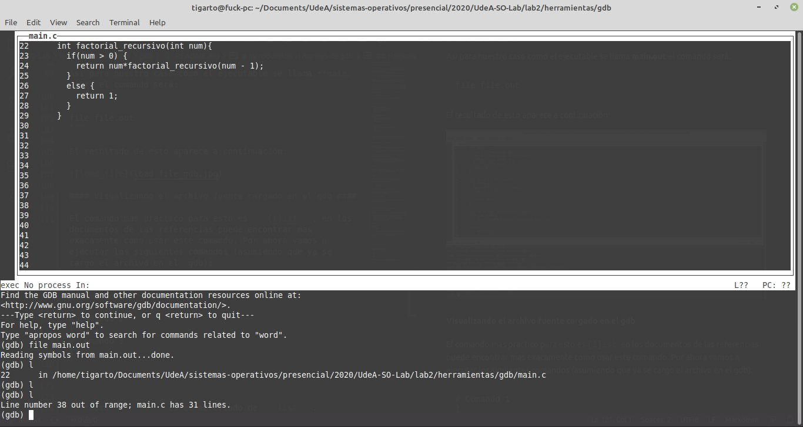
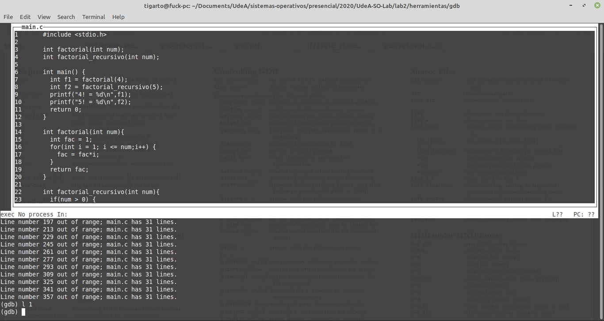
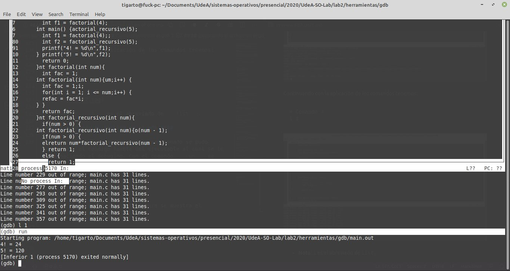
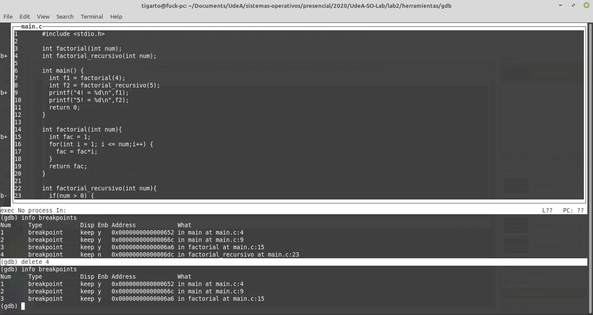

# Introducción al manejo de gdb #

## Antes de empezar ##

## Paao 1 ##
Revise el contenido de apoyo descrito a continuación:
1. [GDB Tutorial A Walkthrough with Examples](./refencias/gdb-tutorial-handout.pdf)
2. [gdb Cheatsheet](./refencias/gdb.pdf)
3. [GDB Cheat Sheet](./refencias/GDB-cheat-sheet.pdf)

Mas documentos pueden ser encontrados en el directorio [referencias](./referencias)

## Paso 2 ##
Complemente el contenido anterior viendo el video: [GDB](https://www.youtube.com/watch?reload=9&v=G4OIp_5fF1A). 

## Paso 3 ##
Para el laboratorio se hará uso del **gdb** disponible en la maquina con linux. Sin embargo lo animamos a que haga uso de otras alternativas más amigables como [onlinegdb](https://www.onlinegdb.com/) o [gdbgui](https://www.gdbgui.com/).

## Haciendo unos ensayos previos para comprender el codigo ##

### Codificación del programa ###

Codifique el siguiente programa guardandolo como ```main.c```


```C
#include <stdio.h>

int main() {
  int f1 = factorial(4);
  int f1 = factorial_recursivo(5);
  printf("4! = %d\n",f1);
  printf("5! = %d\n",f2);
  return 0;
}

int factorial(int num){
  fac = 1;
  for(int = 1; i <= num;i++) {
    fac = fac*i;  
  }
  return fac;
}

int factorial_recursivo(int num){
  if(num  > 0) {
    return num*factorial_recursivo(num - 1);
  }
  else {
    return 1;
  }
}
```

Usando el siguiente comando compilelo, si tiene errores corrijalo (para ver respuesta seguir el siguiente [enlace](main.c)):

```
gcc -Wall -g main.c -o main.out
```

**Pregunta**:
1. Como se puede notar, se observa un nuevo parametro en el gcc, este es ```-g```. ¿Que significa este?

Una vez que tenga todo corregido continue los pasos dados en la siguiente sección:

### Cacharreando con el gdb ###

#### Arrancando el gdb ####

Para iniciar el **gdb** se emplea el comando ```gdb```, sin embargo usar este solo hacer el debug no es amigable asi que se recomuenta agregar el parametro adicional ```-tui```. De este modo, el comando será:

```
gdb -tui
```

Una vez se esta dentro del ```gdb``` se carga la consola de este esperando la entrada de comandos propios del ```gdb```. Esta tiene la siguiente forma:

```
(gdb) 
```

#### Conociendo los comandos disponibles ####

Para tal fin se usan los comandos:
* ```help```
* ```help all```
* ```help [comando]```
* ```apropos word```


#### Cargando un archivo en el gdb ####

Una vez el gdb arranco (```gdb -tui```) se carga un archivo mediante el comando:

```
file nombreEjecutable
```

Asi para nuestro caso como el ejecutable se llama **main.out** el comando será:

```
file file.out
```

El resultado de esto aparece a continuación:


#### Visualizando el archivo fuente cargado en el gdb ####

El comando mas practico para esto es ```[l]ist```, en los documentos de las referencias puede encontrar mas exacamente como usar este comando. Por ahora vamos a ejecutar los siguientes comandos (asumiendo que ya se cargo el archivo en el  gdb):

```
# Comando 1
l
# Comando 2
l
# Comando 3
l
```

La salida es algo como lo siguiente:



Continuando con la aplicación de los comandos tenemos:

```
# Comando 4
l 1
```



* **Nota**: ```l``` es el abreviado de ```list```.

#### Ejecutando el archivo en el gdb ####

Con el comando list anteriormente mencionado se pudo visualizar el condigo fuente del ejecutable al cual se le esta haciendo el debuging. Con el comando ```run``` se ejecuta el programa:

```
run
```



Una vez ejecutado el programa si lo que se quiere es ejecutarlo nuevamente se puede correr nuevamente este comando.

#### Colocando breakpoints ####

Un **breakpoint** hace referencia a un punto de parada en la ejecución del codigo. Estos son muy comunes para el desarrollo de pruebas de escritorio ya que permiten ir evaluando el estado de las variables a medida que el programador va moviendose entre estos. El comando para poner un breakpoint es ```[b]reak``` y sus diferentes variantes pueden consultarse en las referencias de apoyo dispuestas. Por ahora ejecutemos los siguientes comandos. Antes de esto tenga en cuenta que el abreviado  del comando ```break``` es ```b``` y es con este ultimo que se ejecutan los ejemplos:


```
# Comando 1
b 4
# Comando 2
break 9
# Comando 3
b factorial
```

La siguiente figura muestra el resultado:


Notese de la figura anterior, los simbolos **b+** agregados a la izquierda del codigo. Es alli donde se colocaron los breakpoints. Es bueno vez colocados los breakpoints listarlos, para ello se usa el comandos:

```
# Comando 4
info breakpoints
```

La siguiente figura muestra el resultado:


Notese que cada breakpoint tiene información asociada a este pero resaltamos la primera columna en la cual se puede ver el numero del breakpoint. Conocer este numero es importante por que es el que se emplea para eliminar o desabilitar un breakpoint determinado. Para ello vamos a realizar las siguientes tareas:
1. Agregar un breakpoint en la función ```factorial_recursivo``` 
2. Listar los breakpoints disponibles.
   
```
# Comando 5
break factorial_recursivo

# Comando 6
info breakpoints
```

En la siguiente figura se muestra el resultado:


3. Deshabilitar el breakpoint anteriormente agregado (ojo tenga en cuenta el numero de este).
4. Listar los breakpoints disponibles para ver los cambios.

```
# Comando 7
disable 4

# Comando 8
info breakpoints
```

En la siguiente figura se muestra el resultado. Observe los cambios:


5. Eliminar el breakpoint anterior y listar nuevamente los breakpoints disponibles para ver los cambios. 

```
# Comando 9
delete 4

# Comando 10
info breakpoints
```

Para el caso, en la siguiente figura se muestra el resultado:

En la siguiente figura se muestra el resultado. Observe los cambios:



#### Moviendonos entre los breakpoints y observando la evolución de las variables ####


Entrando al codigo 


Visualizando variables
poniendo breakpoints
continue

Stepp
next

info


http://www.yolinux.com/TUTORIALS/GDB-Commands.html