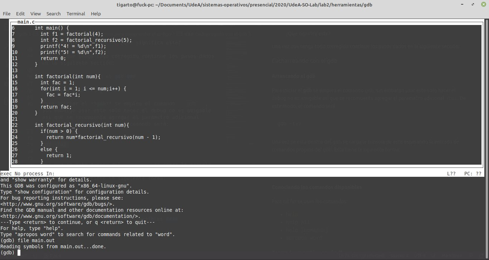

# Introducción al manejo de gdb #

## Antes de empezar ##

## Paao 1 ##
Revise el contenido de apoyo descrito a continuación:
1. [GDB Tutorial A Walkthrough with Examples](./refencias/gdb-tutorial-handout.pdf)
2. [gdb Cheatsheet](./refencias/gdb.pdf)
3. [GDB Cheat Sheet](./refencias/GDB-cheat-sheet.pdf)

Mas documentos pueden ser encontrados en el directorio [referencias](./referencias)

## Paso 2 ##
Complemente el contenido anterior viendo el video: [GDB](https://www.youtube.com/watch?reload=9&v=G4OIp_5fF1A). 

## Paso 3 ##
Para el laboratorio se hará uso del **gdb** disponible en la maquina con linux. Sin embargo lo animamos a que haga uso de otras alternativas más amigables como [onlinegdb](https://www.onlinegdb.com/) o [gdbgui](https://www.gdbgui.com/).

## Haciendo unos ensayos previos para comprender el codigo ##

### Codificación del programa ###

Codifique el siguiente programa guardandolo como ```main.c```


```C
#include <stdio.h>

int main() {
  int f1 = factorial(4);
  int f1 = factorial_recursivo(5);
  printf("4! = %d\n",f1);
  printf("5! = %d\n",f2);
  return 0;
}

int factorial(int num){
  fac = 1;
  for(int = 1; i <= num;i++) {
    fac = fac*i;  
  }
  return fac;
}

int factorial_recursivo(int num){
  if(num  > 0) {
    return num*factorial_recursivo(num - 1);
  }
  else {
    return 1;
  }
}
```

Usando el siguiente comando compilelo, si tiene errores corrijalo (para ver respuesta seguir el siguiente [enlace](main.c)):

```
gcc -Wall -g main.c -o main.out
```

**Pregunta**:
1. Como se puede notar, se observa un nuevo parametro en el gcc, este es ```-g```. ¿Que significa este?

Una vez que tenga todo corregido continue los pasos dados en la siguiente sección:

### Cacharreando con el gdb ###

#### Arrancando el gdb ####

Para iniciar el **gdb** se emplea el comando ```gdb```, sin embargo usar este solo hacer el debug no es amigable asi que se recomuenta agregar el parametro adicional ```-tui```. De este modo, el comando será:

```
gdb -tui
```

Una vez se esta dentro del ```gdb``` se carga la consola de este esperando la entrada de comandos propios del ```gdb```. Esta tiene la siguiente forma:

```
(gdb) 
```

#### Conociendo los comandos disponibles ####

Para tal fin se usan los comandos:
* ```help```
* ```help all```
* ```help [comando]```
* ```apropos word```


#### Cargando un archivo en el gdb ####

Una vez el gdb arranco (```gdb -tui```) se carga un archivo mediante el comando:

```
file nombreEjecutable
```

Asi para nuestro caso como el ejecutable se llama **main.out** el comando será:

```
file file.out
```

El resultado de esto aparece a continuación:




Entrando al codigo 


Visualizando variables
poniendo breakpoints
continue

Stepp
next

info


